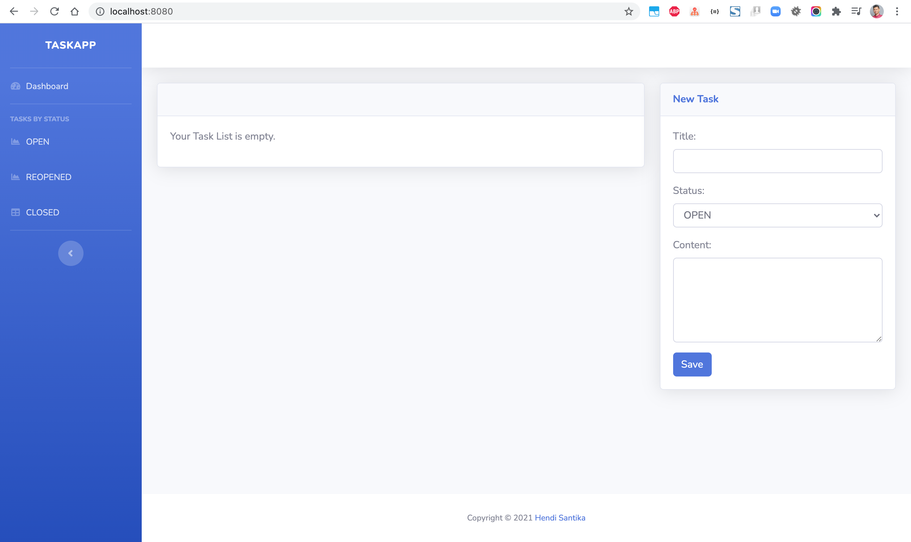
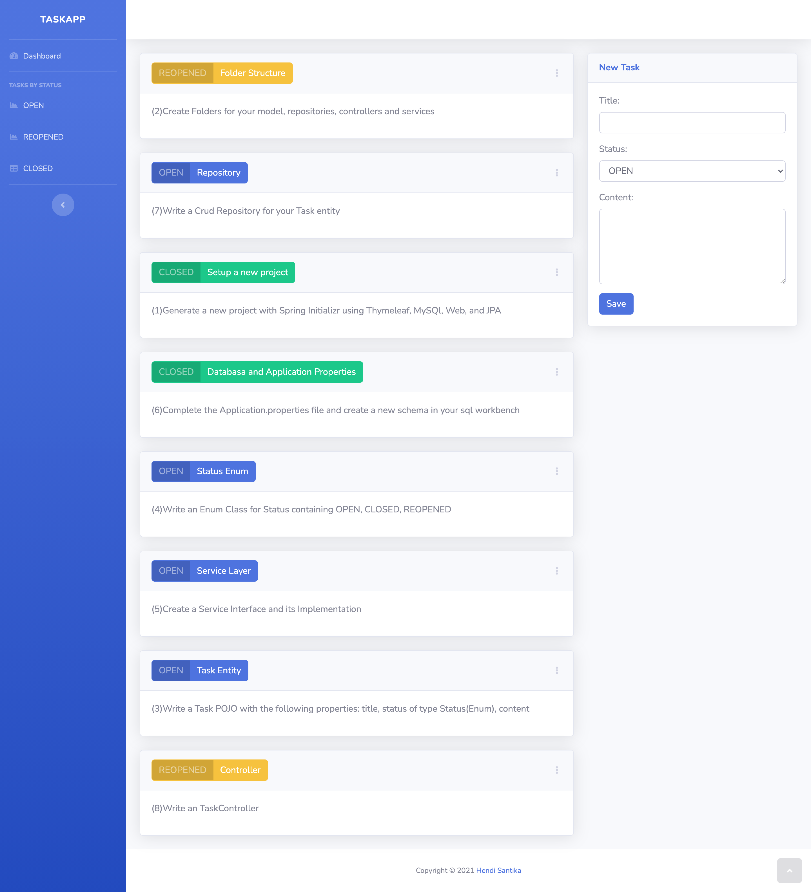
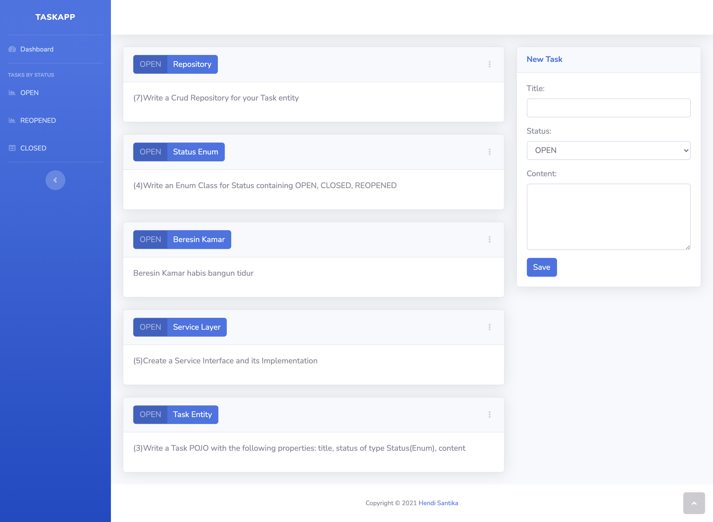
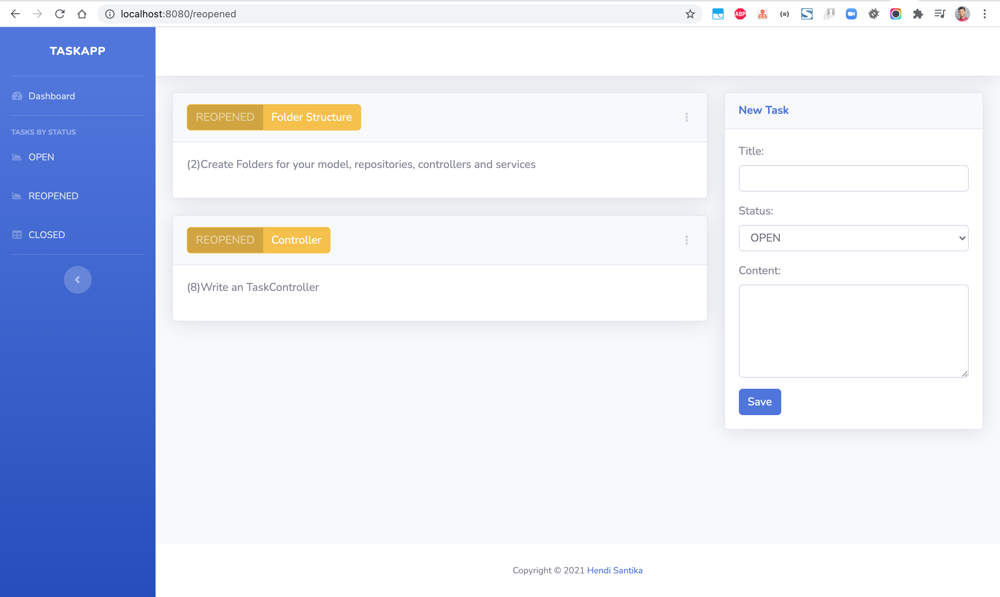

# springboot-task-app

### Things todo list:

1. Clone this repository: `git clone https://github.com/hendisantika/springboot-task-app.git`
2. Navigate to the folder: `cd springboot-task-app`
3. Configure your DB credentials in application.properties
4. Run the application: `mvn clean spring:boot run`
5. Open your favorite browser: http://localhost:8080

### Images Screen shot

Dashboard Page

Open Page

Reopened Page

Closed Page

